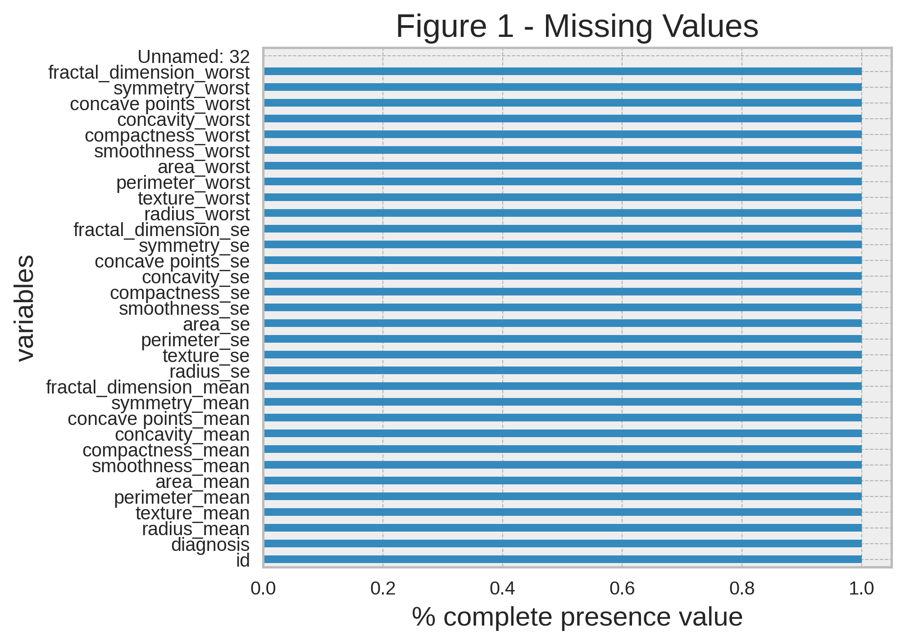

# Exploratory Data Analysis:

## About the project and data: 
The objective of this project was to carry out several steps of a data science project, going through the exploratory analysis stage, performing data pre-processing, model selection, evaluating the models, and selecting the final classification model. It also aimed to implement and use a data science project pattern based on the cookiecutter data science project template.

The selected data was taken from Kaggle ref: [source]('https://www.kaggle.com/datasets/erdemtaha/cancer-data'). They represent geometric characteristics of cancer cells that were classified as benign and malignant. 
## Struture data and some informations: 

The original dataset consists of 30 columns/features and 570 records. All features except the target variable `diagnosis` are continuous numerical variables. Next, we will evaluate missing data and/or duplicates. 

### Missing Values and duplicated

The dataset has no missing values or duplicate values, as seen in the image below.

<p align="center">
  
</p>

The variables id and Unnamed are not representative for the analysis and models, therefore they will be excluded. For the target variable 'diagnosis', a change in the classes will be made according to the following agreement:
* B = 0  
* M = 1.

Next, we will evaluate the statistical summaries, distributions, and correlations of the data.

### Summarize Statistics

The statistical summaries such as mean, standard deviation, and median can be observed in the following images: 

```python
summarize = data.describe()
summarize.T[:14]
```

<p align="center">
  
</p>


```python
summarize = data.describe()
summarize.T[14:30]
```

<p align="center">
  
</p>

We can notice that there are different scales among the data, for example, average values ranging from 0.002 up to a maximum of 880. These scale differences can affect the importance that the model will assign to each variable. In the pre-processing stage, these differences will be addressed by normalizing the data.

### Distributions
Looking to perform a quick check on the data distributions, we conducted the Shapiro-Wilk test to verify the normality of each distribution. The following code returns only the variables for which we failed to reject h0 = the variable's distribution follows a normal distribution. 

```python
# Verify to all columns Shapiro-Wilk test, print just the variable that we can reject the H0: 
for col in data.columns:
    stat, p = shapiro(data[col])
    if p >= 0.05:
        print(f'{col}:p-value = {p:.6f}')
```
As we can see, no values were returned. Therefore, we reject the hypothesis that the data follows a normal distribution. The following are the plots for the variables with their corresponding skewness and kurtosis values: 

* Skewness:

<p align="center">
  
</p>

* Kurtosis:

<p align="center">
  
</p>

To create a visualization of the data distribution, since there are many variables and also different types of scales, we will divide them into groups of similarity according to their means. Therefore, we will create the following groups: 

    * Group A : 0 > mean <=1  
    * Group B : 1 > mean <=20  
    * Group C : 20 > mean <=100  
    * Group D : 100 > mean <= 1000 

Here is the violin plot for the following variables: 

<p align="center">
  
</p>

### About Correlations: 

<p align="center">
  
</p>

The heat map shows the presence of several columns with a high degree of correlation. This factor generates information redundancy or multicollinearity, which impairs the identification of variable importance to predict the target when training the model. What can explain the high correlation between variables is that practically all of them are derived from one geometric characteristic of the cell.

For a graphical representation of the relationships between multiple variables, we have the RadViz plot:

<p align="center">
  
</p>

With the aim of reducing this multicollinearity, we will perform filtering for columns that have high correlation, above 0.95, and exclude collinearity by choosing only one group of columns to remain in the dataset. A new dataset will be created for this transformation and saved in data2 for later preprocessing and model training steps. 

Next are the columns that present a high correlation rate:

```python
correleted_columns = correlated_columns(data.drop('diagnosis', axis=1))
correleted_columns
```
           level_0          level_1   pearson
    0    perimeter_mean      radius_mean  0.997855
    1         area_mean      radius_mean  0.987357
    2         area_mean   perimeter_mean  0.986507
    3      perimeter_se        radius_se  0.972794
    4           area_se        radius_se  0.951830
    5      radius_worst      radius_mean  0.969539
    6      radius_worst   perimeter_mean  0.969476
    7      radius_worst        area_mean  0.962746
    8   perimeter_worst      radius_mean  0.965137
    9   perimeter_worst   perimeter_mean  0.970387
    10  perimeter_worst        area_mean  0.959120
    11  perimeter_worst     radius_worst  0.993708
    12       area_worst        area_mean  0.959213
    13       area_worst     radius_worst  0.984015
    14       area_worst  perimeter_worst  0.977578


```python
# Create a second dataset data2 with contain the drop about correlated columns level1
data2 = data.drop(correleted_columns.level_1.unique(), axis=1)
```

Therefore, we have two data models for the preprocessing and model training stage. The datasets that underwent transformations were saved in the directory `./data/interim`.
  * `data.csv`: Does not contain `id` columns, changes classes `diagnosis` to (0,1).
  * `data2.csv`: Copy of `data.csv` with exclusion of columns with high correlations.  

### About balancing the target variable class:

To check the class balance in the target variable we have:

<p align="center">
  
</p>

<button><a href="https://github.com/sabinorsp/cancer_data_classification/tree/master" class="btn btn-primary" >Return Page</a></button> ______________________________________________________________________________________________________
<button><a href="https://github.com/sabinorsp/cancer_data_classification/blob/master/reports/models.md" class="btn btn-primary" >Preprocessing-TraningModel</a></button>