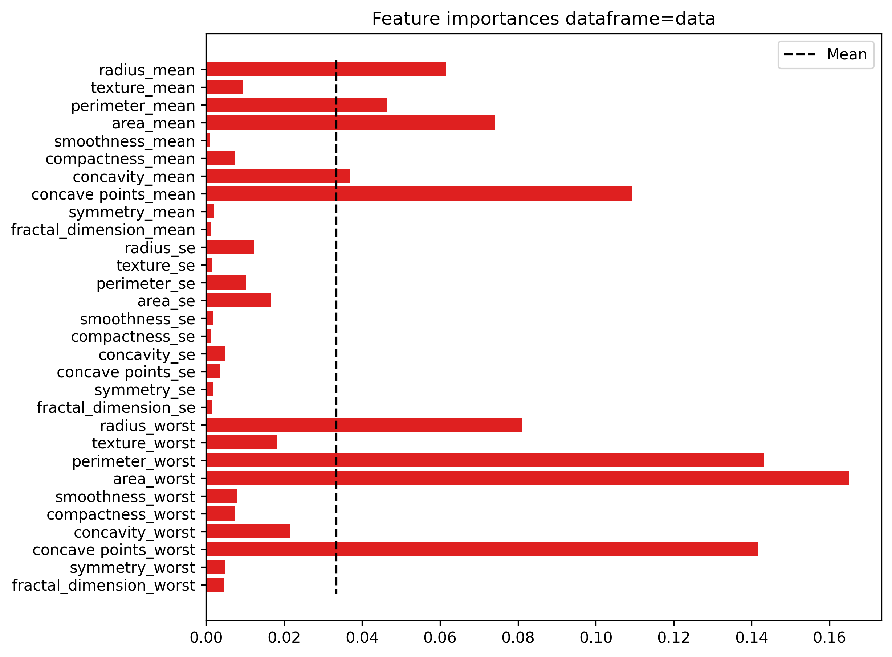
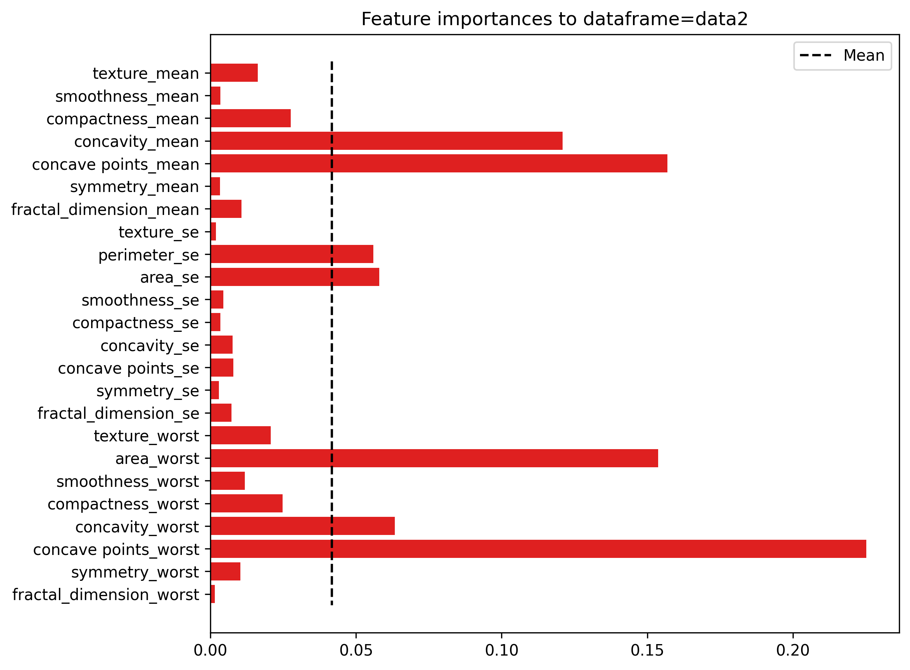

# Models

## Pre-Processing

Foi utilizado 20% dos dados para divisão dos dados de teste, conforme a seguir: 

```python
# Split train and test data
X_train, X_test, y_train, y_test = train_test_split(X,y,test_size=0.2, random_state=40)
X_train2, X_test2= train_test_split(X_2,test_size=0.2, random_state=40)
```

Foi aplicado para todas as variáveis a normalização usando o `MinMaxScaler` do pacote `scikit-learn`.

```python
# Apply standard to each X's data: 
scaler = MinMaxScaler()
X_train_scaler = scaler.fit_transform(X_train)
X_test_scaler = scaler.fit_transform(X_test)
X_train_scaler2 = scaler.fit_transform(X_train2)
X_test_scaler2 = scaler.fit_transform(X_test2)
```
Os dados ficaram portanto divididos em 4 subsets para o treinamento e teste, sendo os respectivos dados para cada grupo de dados `data.csv` e `data2.csv`. 

A seguir foi realizado a seleção de variáveis utilizando a seleção das melhores importancias com o uso do RandomForest com critério gini, calculando a média de todas importancias e selecionando as variaveis que possuem valores acima dessa média. Os resutlados podem ser observados conforme as figuras abaixo:  

* X_train - data.csv:

<p align="center">
  
</p>

* X_train - data2.csv: 

<p align="center">
  
</p>

Para o conjunto de dados `data.csv` 9 variáveis apresentaram destaque no grau de importancia contra 7 variáveis para o `data2.csv`. Os respectivos dados de treinamento e teste para cada conjunto preprocessado foram salvos no diretório `./data/processed/`. Dados que serão utilizados pelo algoritmo para realizar as seleções de modelo, treinamentos, otimizações e avaliações finais do modelo. Abaixo segue um resumo da estrutura. 

* `data.csv`: 
    * X_data: 
        * X_train.csv
        * X_test.csv
        * X_train_feature.csv
        * X_test_feature.csv

* `data2.csv`:
    * X_data2:
        * X_train2.csv
        * X_test2.csv
        * X_train2_features.csv
        * X_test2_features.csv

* Variável alvo: 
    * y_train.csv
    * y_test.csv
## Select Models

## Traning models 

# Evaluation models

# Conclusions